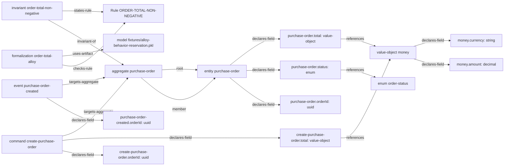

# Specification Relationships commerce-domain-fixture

- version: `0.1.0`
- status: `pass`
- nodes: `18`
- relationships: `19`

## Relationship ledger

| From | Relation | To |
| --- | --- | --- |
| `domain/aggregate/purchase-order` | `member` | `domain/entity/purchase-order` |
| `domain/aggregate/purchase-order` | `root` | `domain/entity/purchase-order` |
| `domain/command/create-purchase-order` | `declares-field` | `domain/field/commands/create-purchase-order/orderId` |
| `domain/command/create-purchase-order` | `declares-field` | `domain/field/commands/create-purchase-order/total` |
| `domain/command/create-purchase-order` | `targets-aggregate` | `domain/aggregate/purchase-order` |
| `domain/entity/purchase-order` | `declares-field` | `domain/field/entities/purchase-order/orderId` |
| `domain/entity/purchase-order` | `declares-field` | `domain/field/entities/purchase-order/status` |
| `domain/entity/purchase-order` | `declares-field` | `domain/field/entities/purchase-order/total` |
| `domain/event/purchase-order-created` | `declares-field` | `domain/field/events/purchase-order-created/orderId` |
| `domain/event/purchase-order-created` | `targets-aggregate` | `domain/aggregate/purchase-order` |
| `domain/field/commands/create-purchase-order/total` | `references` | `domain/value-object/money` |
| `domain/field/entities/purchase-order/status` | `references` | `domain/enum/order-status` |
| `domain/field/entities/purchase-order/total` | `references` | `domain/value-object/money` |
| `domain/formalization/order-total-alloy` | `checks-rule` | `rule/ORDER-TOTAL-NON-NEGATIVE` |
| `domain/formalization/order-total-alloy` | `uses-artifact` | `artifact/model/fixtures/alloy-behavior-reservation.pkl` |
| `domain/invariant/order-total-non-negative` | `invariant-of` | `domain/aggregate/purchase-order` |
| `domain/invariant/order-total-non-negative` | `states-rule` | `rule/ORDER-TOTAL-NON-NEGATIVE` |
| `domain/value-object/money` | `declares-field` | `domain/field/valueObjects/money/amount` |
| `domain/value-object/money` | `declares-field` | `domain/field/valueObjects/money/currency` |

## Diagram

