# Specification Relationships tetris-baseline

- version: `0.1.0`
- status: `pass`
- nodes: `123`
- relationships: `167`

## Relationship ledger

| From | Relation | To |
| --- | --- | --- |
| `domain/aggregate/tetris-game` | `member` | `domain/entity/tetris-game` |
| `domain/aggregate/tetris-game` | `root` | `domain/entity/tetris-game` |
| `domain/command/hard-drop-active-piece` | `declares-field` | `domain/field/commands/hard-drop-active-piece/gameId` |
| `domain/command/hard-drop-active-piece` | `targets-aggregate` | `domain/aggregate/tetris-game` |
| `domain/command/rotate-active-piece` | `declares-field` | `domain/field/commands/rotate-active-piece/gameId` |
| `domain/command/rotate-active-piece` | `targets-aggregate` | `domain/aggregate/tetris-game` |
| `domain/command/start-game` | `declares-field` | `domain/field/commands/start-game/gameId` |
| `domain/command/start-game` | `targets-aggregate` | `domain/aggregate/tetris-game` |
| `domain/command/tick-gravity` | `declares-field` | `domain/field/commands/tick-gravity/gameId` |
| `domain/command/tick-gravity` | `targets-aggregate` | `domain/aggregate/tetris-game` |
| `domain/command/translate-active-piece` | `declares-field` | `domain/field/commands/translate-active-piece/gameId` |
| `domain/command/translate-active-piece` | `declares-field` | `domain/field/commands/translate-active-piece/translation` |
| `domain/command/translate-active-piece` | `targets-aggregate` | `domain/aggregate/tetris-game` |
| `domain/entity/tetris-game` | `declares-field` | `domain/field/entities/tetris-game/activePiece` |
| `domain/entity/tetris-game` | `declares-field` | `domain/field/entities/tetris-game/board` |
| `domain/entity/tetris-game` | `declares-field` | `domain/field/entities/tetris-game/clearedLineCount` |
| `domain/entity/tetris-game` | `declares-field` | `domain/field/entities/tetris-game/gameId` |
| `domain/entity/tetris-game` | `declares-field` | `domain/field/entities/tetris-game/lockedPieceCount` |
| `domain/entity/tetris-game` | `declares-field` | `domain/field/entities/tetris-game/status` |
| `domain/event/active-piece-rotated` | `declares-field` | `domain/field/events/active-piece-rotated/gameId` |
| `domain/event/active-piece-rotated` | `targets-aggregate` | `domain/aggregate/tetris-game` |
| `domain/event/active-piece-translated` | `declares-field` | `domain/field/events/active-piece-translated/gameId` |
| `domain/event/active-piece-translated` | `declares-field` | `domain/field/events/active-piece-translated/translation` |
| `domain/event/active-piece-translated` | `targets-aggregate` | `domain/aggregate/tetris-game` |
| `domain/event/game-over` | `declares-field` | `domain/field/events/game-over/gameId` |
| `domain/event/game-over` | `targets-aggregate` | `domain/aggregate/tetris-game` |
| `domain/event/game-started` | `declares-field` | `domain/field/events/game-started/gameId` |
| `domain/event/game-started` | `targets-aggregate` | `domain/aggregate/tetris-game` |
| `domain/event/lines-cleared` | `declares-field` | `domain/field/events/lines-cleared/gameId` |
| `domain/event/lines-cleared` | `declares-field` | `domain/field/events/lines-cleared/lineCount` |
| `domain/event/lines-cleared` | `targets-aggregate` | `domain/aggregate/tetris-game` |
| `domain/event/piece-locked` | `declares-field` | `domain/field/events/piece-locked/gameId` |
| `domain/event/piece-locked` | `targets-aggregate` | `domain/aggregate/tetris-game` |
| `domain/field/commands/translate-active-piece/translation` | `references` | `domain/value-object/translation` |
| `domain/field/entities/tetris-game/activePiece` | `references` | `domain/value-object/active-piece` |
| `domain/field/entities/tetris-game/board` | `references` | `domain/value-object/board` |
| `domain/field/entities/tetris-game/status` | `references` | `domain/enum/game-status` |
| `domain/field/events/active-piece-translated/translation` | `references` | `domain/value-object/translation` |
| `domain/field/valueObjects/active-piece/kind` | `references` | `domain/enum/tetromino-kind` |
| `domain/field/valueObjects/active-piece/origin` | `references` | `domain/value-object/board-coordinate` |
| `domain/formalization/board-bounds-alloy` | `asserts-check` | `formal-check/board-bounds-alloy/tetris.board.bounds.holds` |
| `domain/formalization/board-bounds-alloy` | `checks-rule` | `rule/TETRIS-BOARD-BOUNDS` |
| `domain/formalization/board-bounds-alloy` | `models-action` | `formal-action/board-bounds-alloy/rotate` |
| `domain/formalization/board-bounds-alloy` | `uses-artifact` | `artifact/model/fixtures/tetris-alloy.pkl` |
| `domain/formalization/coordinate-blocked-spawn-alloy` | `asserts-check` | `formal-check/coordinate-blocked-spawn-alloy/tetris.coordinate-spawn.blocked-game-over.holds` |
| `domain/formalization/coordinate-blocked-spawn-alloy` | `checks-rule` | `rule/TETRIS-SPAWN-GAME-OVER` |
| `domain/formalization/coordinate-blocked-spawn-alloy` | `models-action` | `formal-action/coordinate-blocked-spawn-alloy/blockedSpawnGameOver` |
| `domain/formalization/coordinate-blocked-spawn-alloy` | `uses-artifact` | `artifact/model/fixtures/tetris-alloy.pkl` |
| `domain/formalization/coordinate-start-spawn-alloy` | `asserts-check` | `formal-check/coordinate-start-spawn-alloy/tetris.coordinate-spawn.availability-refines-coordinates.holds` |
| `domain/formalization/coordinate-start-spawn-alloy` | `asserts-check` | `formal-check/coordinate-start-spawn-alloy/tetris.coordinate-spawn.clear-starts-game.holds` |
| `domain/formalization/coordinate-start-spawn-alloy` | `asserts-check` | `formal-check/coordinate-start-spawn-alloy/tetris.coordinate-spawn.implementation-input-conforms.holds` |
| `domain/formalization/coordinate-start-spawn-alloy` | `checks-rule` | `rule/TETRIS-START-GAME` |
| `domain/formalization/coordinate-start-spawn-alloy` | `models-action` | `formal-action/coordinate-start-spawn-alloy/startGameAtSpawn` |
| `domain/formalization/coordinate-start-spawn-alloy` | `uses-artifact` | `artifact/model/fixtures/tetris-alloy.pkl` |
| `domain/formalization/gravity-lock-behavior` | `asserts-check` | `formal-check/gravity-lock-behavior/tetris.at-most-one-active-piece-always` |
| `domain/formalization/gravity-lock-behavior` | `asserts-check` | `formal-check/gravity-lock-behavior/tetris.gravity-path-eventually-locks` |
| `domain/formalization/gravity-lock-behavior` | `asserts-check` | `formal-check/gravity-lock-behavior/tetris.lock.reachable` |
| `domain/formalization/gravity-lock-behavior` | `checks-rule` | `rule/TETRIS-GRAVITY-LOCKS` |
| `domain/formalization/gravity-lock-behavior` | `models-action` | `formal-action/gravity-lock-behavior/gravity` |
| `domain/formalization/gravity-lock-behavior` | `models-action` | `formal-action/gravity-lock-behavior/lock` |
| `domain/formalization/gravity-lock-behavior` | `uses-artifact` | `artifact/model/fixtures/tetris-gravity-behavior.pkl` |
| `domain/formalization/line-clear-alloy` | `asserts-check` | `formal-check/line-clear-alloy/tetris.full-row.clear-and-compact.holds` |
| `domain/formalization/line-clear-alloy` | `checks-rule` | `rule/TETRIS-CLEAR-FULL-ROWS` |
| `domain/formalization/line-clear-alloy` | `models-action` | `formal-action/line-clear-alloy/clearFullRows` |
| `domain/formalization/line-clear-alloy` | `uses-artifact` | `artifact/model/fixtures/tetris-line-clear-alloy.pkl` |
| `domain/formalization/no-overlap-alloy` | `asserts-check` | `formal-check/no-overlap-alloy/tetris.board.disjoint.holds` |
| `domain/formalization/no-overlap-alloy` | `checks-rule` | `rule/TETRIS-NO-OVERLAP` |
| `domain/formalization/no-overlap-alloy` | `models-action` | `formal-action/no-overlap-alloy/rotate` |
| `domain/formalization/no-overlap-alloy` | `uses-artifact` | `artifact/model/fixtures/tetris-alloy.pkl` |
| `domain/formalization/rotation-rejection-alloy` | `asserts-check` | `formal-check/rotation-rejection-alloy/tetris.rotation.collision-rejected.holds` |
| `domain/formalization/rotation-rejection-alloy` | `checks-rule` | `rule/TETRIS-LEGAL-ROTATION` |
| `domain/formalization/rotation-rejection-alloy` | `models-action` | `formal-action/rotation-rejection-alloy/rejectRotation` |
| `domain/formalization/rotation-rejection-alloy` | `uses-artifact` | `artifact/model/fixtures/tetris-alloy.pkl` |
| `domain/formalization/spawn-game-over-behavior` | `asserts-check` | `formal-check/spawn-game-over-behavior/tetris.spawn-collision.eventually-game-over` |
| `domain/formalization/spawn-game-over-behavior` | `asserts-check` | `formal-check/spawn-game-over-behavior/tetris.spawn-collision.game-over.reachable` |
| `domain/formalization/spawn-game-over-behavior` | `checks-rule` | `rule/TETRIS-SPAWN-GAME-OVER` |
| `domain/formalization/spawn-game-over-behavior` | `models-action` | `formal-action/spawn-game-over-behavior/spawnBlocked` |
| `domain/formalization/spawn-game-over-behavior` | `uses-artifact` | `artifact/model/fixtures/tetris-spawn-game-over-behavior.pkl` |
| `domain/formalization/start-game-behavior` | `asserts-check` | `formal-check/start-game-behavior/tetris.start-game.eventually-started` |
| `domain/formalization/start-game-behavior` | `asserts-check` | `formal-check/start-game-behavior/tetris.start-game.started.reachable` |
| `domain/formalization/start-game-behavior` | `checks-rule` | `rule/TETRIS-START-GAME` |
| `domain/formalization/start-game-behavior` | `models-action` | `formal-action/start-game-behavior/startGame` |
| `domain/formalization/start-game-behavior` | `uses-artifact` | `artifact/model/fixtures/tetris-start-game-behavior.pkl` |
| `domain/formalization/terminal-game-over-behavior` | `asserts-check` | `formal-check/terminal-game-over-behavior/tetris.game-over.always-terminal` |
| `domain/formalization/terminal-game-over-behavior` | `asserts-check` | `formal-check/terminal-game-over-behavior/tetris.game-over.playing.unreachable` |
| `domain/formalization/terminal-game-over-behavior` | `checks-rule` | `rule/TETRIS-TERMINAL-GAME-OVER` |
| `domain/formalization/terminal-game-over-behavior` | `models-action` | `formal-action/terminal-game-over-behavior/gravity` |
| `domain/formalization/terminal-game-over-behavior` | `models-action` | `formal-action/terminal-game-over-behavior/lock` |
| `domain/formalization/terminal-game-over-behavior` | `models-action` | `formal-action/terminal-game-over-behavior/rotate` |
| `domain/formalization/terminal-game-over-behavior` | `models-action` | `formal-action/terminal-game-over-behavior/translate` |
| `domain/formalization/terminal-game-over-behavior` | `uses-artifact` | `artifact/model/fixtures/tetris-terminal-game-over-behavior.pkl` |
| `domain/formalization/translation-rejection-alloy` | `asserts-check` | `formal-check/translation-rejection-alloy/tetris.translation.illegal-rejected.holds` |
| `domain/formalization/translation-rejection-alloy` | `checks-rule` | `rule/TETRIS-LEGAL-TRANSLATION` |
| `domain/formalization/translation-rejection-alloy` | `models-action` | `formal-action/translation-rejection-alloy/rejectTranslateLeft` |
| `domain/formalization/translation-rejection-alloy` | `uses-artifact` | `artifact/model/fixtures/tetris-alloy.pkl` |
| `domain/invariant/board-bounds` | `invariant-of` | `domain/aggregate/tetris-game` |
| `domain/invariant/board-bounds` | `states-rule` | `rule/TETRIS-BOARD-BOUNDS` |
| `domain/invariant/gravity-locks-piece` | `invariant-of` | `domain/aggregate/tetris-game` |
| `domain/invariant/gravity-locks-piece` | `states-rule` | `rule/TETRIS-GRAVITY-LOCKS` |
| `domain/invariant/no-overlap` | `invariant-of` | `domain/aggregate/tetris-game` |
| `domain/invariant/no-overlap` | `states-rule` | `rule/TETRIS-NO-OVERLAP` |
| `domain/invariant/terminal-game-over` | `invariant-of` | `domain/aggregate/tetris-game` |
| `domain/invariant/terminal-game-over` | `states-rule` | `rule/TETRIS-TERMINAL-GAME-OVER` |
| `domain/refinement/spawn-open-from-coordinates` | `abstracts-formalization` | `domain/formalization/start-game-behavior` |
| `domain/refinement/spawn-open-from-coordinates` | `asserts-check` | `formal-check/coordinate-start-spawn-alloy/tetris.coordinate-spawn.availability-refines-coordinates.holds` |
| `domain/refinement/spawn-open-from-coordinates` | `asserts-check` | `formal-check/coordinate-start-spawn-alloy/tetris.coordinate-spawn.implementation-input-conforms.holds` |
| `domain/refinement/spawn-open-from-coordinates` | `preserves-rule` | `rule/TETRIS-START-GAME` |
| `domain/refinement/spawn-open-from-coordinates` | `refines-to-formalization` | `domain/formalization/coordinate-start-spawn-alloy` |
| `domain/refinement/spawn-open-from-coordinates` | `states-relation` | `formal-relation/spawn-open-from-coordinates` |
| `domain/value-object/active-piece` | `declares-field` | `domain/field/valueObjects/active-piece/kind` |
| `domain/value-object/active-piece` | `declares-field` | `domain/field/valueObjects/active-piece/orientation` |
| `domain/value-object/active-piece` | `declares-field` | `domain/field/valueObjects/active-piece/origin` |
| `domain/value-object/board-coordinate` | `declares-field` | `domain/field/valueObjects/board-coordinate/x` |
| `domain/value-object/board-coordinate` | `declares-field` | `domain/field/valueObjects/board-coordinate/y` |
| `domain/value-object/board` | `declares-field` | `domain/field/valueObjects/board/height` |
| `domain/value-object/board` | `declares-field` | `domain/field/valueObjects/board/lockedCellCount` |
| `domain/value-object/board` | `declares-field` | `domain/field/valueObjects/board/width` |
| `domain/value-object/translation` | `declares-field` | `domain/field/valueObjects/translation/deltaX` |
| `domain/value-object/translation` | `declares-field` | `domain/field/valueObjects/translation/deltaY` |
| `formal-action/board-bounds-alloy/rotate` | `emits-event` | `domain/event/active-piece-rotated` |
| `formal-action/board-bounds-alloy/rotate` | `implements-command` | `domain/command/rotate-active-piece` |
| `formal-action/coordinate-blocked-spawn-alloy/blockedSpawnGameOver` | `emits-event` | `domain/event/game-over` |
| `formal-action/coordinate-start-spawn-alloy/startGameAtSpawn` | `emits-event` | `domain/event/game-started` |
| `formal-action/coordinate-start-spawn-alloy/startGameAtSpawn` | `implements-command` | `domain/command/start-game` |
| `formal-action/gravity-lock-behavior/gravity` | `emits-event` | `domain/event/active-piece-translated` |
| `formal-action/gravity-lock-behavior/gravity` | `implements-command` | `domain/command/tick-gravity` |
| `formal-action/gravity-lock-behavior/lock` | `emits-event` | `domain/event/piece-locked` |
| `formal-action/line-clear-alloy/clearFullRows` | `emits-event` | `domain/event/lines-cleared` |
| `formal-action/no-overlap-alloy/rotate` | `emits-event` | `domain/event/active-piece-rotated` |
| `formal-action/no-overlap-alloy/rotate` | `implements-command` | `domain/command/rotate-active-piece` |
| `formal-action/rotation-rejection-alloy/rejectRotation` | `emits-event` | `domain/event/active-piece-rotated` |
| `formal-action/rotation-rejection-alloy/rejectRotation` | `implements-command` | `domain/command/rotate-active-piece` |
| `formal-action/spawn-game-over-behavior/spawnBlocked` | `emits-event` | `domain/event/game-over` |
| `formal-action/start-game-behavior/startGame` | `emits-event` | `domain/event/game-started` |
| `formal-action/start-game-behavior/startGame` | `implements-command` | `domain/command/start-game` |
| `formal-action/terminal-game-over-behavior/gravity` | `implements-command` | `domain/command/tick-gravity` |
| `formal-action/terminal-game-over-behavior/lock` | `emits-event` | `domain/event/piece-locked` |
| `formal-action/terminal-game-over-behavior/lock` | `implements-command` | `domain/command/hard-drop-active-piece` |
| `formal-action/terminal-game-over-behavior/rotate` | `implements-command` | `domain/command/rotate-active-piece` |
| `formal-action/terminal-game-over-behavior/translate` | `implements-command` | `domain/command/translate-active-piece` |
| `formal-action/translation-rejection-alloy/rejectTranslateLeft` | `emits-event` | `domain/event/active-piece-translated` |
| `formal-action/translation-rejection-alloy/rejectTranslateLeft` | `implements-command` | `domain/command/translate-active-piece` |
| `rule/TETRIS-ADVANCED-RULES-OUT-OF-SCOPE` | `uses-term` | `term/tetris.tetromino` |
| `rule/TETRIS-BOARD-BOUNDS` | `uses-term` | `term/tetris.active-piece` |
| `rule/TETRIS-BOARD-BOUNDS` | `uses-term` | `term/tetris.board` |
| `rule/TETRIS-BOARD-BOUNDS` | `uses-term` | `term/tetris.cell` |
| `rule/TETRIS-CLEAR-FULL-ROWS` | `uses-term` | `term/tetris.board` |
| `rule/TETRIS-CLEAR-FULL-ROWS` | `uses-term` | `term/tetris.line-clear` |
| `rule/TETRIS-CLEAR-FULL-ROWS` | `uses-term` | `term/tetris.lock` |
| `rule/TETRIS-GRAVITY-LOCKS` | `uses-term` | `term/tetris.active-piece` |
| `rule/TETRIS-GRAVITY-LOCKS` | `uses-term` | `term/tetris.gravity` |
| `rule/TETRIS-GRAVITY-LOCKS` | `uses-term` | `term/tetris.lock` |
| `rule/TETRIS-LEGAL-ROTATION` | `uses-term` | `term/tetris.active-piece` |
| `rule/TETRIS-LEGAL-ROTATION` | `uses-term` | `term/tetris.board` |
| `rule/TETRIS-LEGAL-TRANSLATION` | `uses-term` | `term/tetris.active-piece` |
| `rule/TETRIS-LEGAL-TRANSLATION` | `uses-term` | `term/tetris.board` |
| `rule/TETRIS-NO-OVERLAP` | `uses-term` | `term/tetris.active-piece` |
| `rule/TETRIS-NO-OVERLAP` | `uses-term` | `term/tetris.board` |
| `rule/TETRIS-NO-OVERLAP` | `uses-term` | `term/tetris.cell` |
| `rule/TETRIS-SPAWN-GAME-OVER` | `uses-term` | `term/tetris.board` |
| `rule/TETRIS-SPAWN-GAME-OVER` | `uses-term` | `term/tetris.game-over` |
| `rule/TETRIS-SPAWN-GAME-OVER` | `uses-term` | `term/tetris.tetromino` |
| `rule/TETRIS-START-GAME` | `uses-term` | `term/tetris.active-piece` |
| `rule/TETRIS-START-GAME` | `uses-term` | `term/tetris.board` |
| `rule/TETRIS-START-GAME` | `uses-term` | `term/tetris.tetromino` |
| `rule/TETRIS-TERMINAL-GAME-OVER` | `uses-term` | `term/tetris.active-piece` |
| `rule/TETRIS-TERMINAL-GAME-OVER` | `uses-term` | `term/tetris.game-over` |

## Diagram

```mermaid
flowchart LR
  N0["model fixtures/tetris-alloy.pkl"]
  N1["model fixtures/tetris-gravity-behavior.pkl"]
  N2["model fixtures/tetris-line-clear-alloy.pkl"]
  N3["model fixtures/tetris-spawn-game-over-behavior.pkl"]
  N4["model fixtures/tetris-start-game-behavior.pkl"]
  N5["model fixtures/tetris-terminal-game-over-behavior.pkl"]
  N6["aggregate tetris-game"]
  N7["command hard-drop-active-piece"]
  N8["command rotate-active-piece"]
  N9["command start-game"]
  N10["command tick-gravity"]
  N11["command translate-active-piece"]
  N12["entity tetris-game"]
  N13["enum game-status"]
  N14["enum tetromino-kind"]
  N15["event active-piece-rotated"]
  N16["event active-piece-translated"]
  N17["event game-over"]
  N18["event game-started"]
  N19["event lines-cleared"]
  N20["event piece-locked"]
  N21["hard-drop-active-piece.gameId: uuid"]
  N22["rotate-active-piece.gameId: uuid"]
  N23["start-game.gameId: uuid"]
  N24["tick-gravity.gameId: uuid"]
  N25["translate-active-piece.gameId: uuid"]
  N26["translate-active-piece.translation: value-object"]
  N27["tetris-game.activePiece: value-object"]
  N28["tetris-game.board: value-object"]
  N29["tetris-game.clearedLineCount: integer"]
  N30["tetris-game.gameId: uuid"]
  N31["tetris-game.lockedPieceCount: integer"]
  N32["tetris-game.status: enum"]
  N33["active-piece-rotated.gameId: uuid"]
  N34["active-piece-translated.gameId: uuid"]
  N35["active-piece-translated.translation: value-object"]
  N36["game-over.gameId: uuid"]
  N37["game-started.gameId: uuid"]
  N38["lines-cleared.gameId: uuid"]
  N39["lines-cleared.lineCount: integer"]
  N40["piece-locked.gameId: uuid"]
  N41["active-piece.kind: enum"]
  N42["active-piece.orientation: integer"]
  N43["active-piece.origin: value-object"]
  N44["board-coordinate.x: integer"]
  N45["board-coordinate.y: integer"]
  N46["board.height: integer"]
  N47["board.lockedCellCount: integer"]
  N48["board.width: integer"]
  N49["translation.deltaX: integer"]
  N50["translation.deltaY: integer"]
  N51["formalization board-bounds-alloy"]
  N52["formalization coordinate-blocked-spawn-alloy"]
  N53["formalization coordinate-start-spawn-alloy"]
  N54["formalization gravity-lock-behavior"]
  N55["formalization line-clear-alloy"]
  N56["formalization no-overlap-alloy"]
  N57["formalization rotation-rejection-alloy"]
  N58["formalization spawn-game-over-behavior"]
  N59["formalization start-game-behavior"]
  N60["formalization terminal-game-over-behavior"]
  N61["formalization translation-rejection-alloy"]
  N62["invariant board-bounds"]
  N63["invariant gravity-locks-piece"]
  N64["invariant no-overlap"]
  N65["invariant terminal-game-over"]
  N66["refinement spawn-open-from-coordinates"]
  N67["value-object active-piece"]
  N68["value-object board"]
  N69["value-object board-coordinate"]
  N70["value-object translation"]
  N71["formal action board-bounds-alloy.rotate"]
  N72["formal action coordinate-blocked-spawn-alloy.blockedSpawnGameOver"]
  N73["formal action coordinate-start-spawn-alloy.startGameAtSpawn"]
  N74["formal action gravity-lock-behavior.gravity"]
  N75["formal action gravity-lock-behavior.lock"]
  N76["formal action line-clear-alloy.clearFullRows"]
  N77["formal action no-overlap-alloy.rotate"]
  N78["formal action rotation-rejection-alloy.rejectRotation"]
  N79["formal action spawn-game-over-behavior.spawnBlocked"]
  N80["formal action start-game-behavior.startGame"]
  N81["formal action terminal-game-over-behavior.gravity"]
  N82["formal action terminal-game-over-behavior.lock"]
  N83["formal action terminal-game-over-behavior.rotate"]
  N84["formal action terminal-game-over-behavior.translate"]
  N85["formal action translation-rejection-alloy.rejectTranslateLeft"]
  N86["formal check board-bounds-alloy.tetris.board.bounds.holds"]
  N87["formal check coordinate-blocked-spawn-alloy.tetris.coordinate-spawn.blocked-game-over.holds"]
  N88["formal check coordinate-start-spawn-alloy.tetris.coordinate-spawn.availability-refines-coordinates.holds"]
  N89["formal check coordinate-start-spawn-alloy.tetris.coordinate-spawn.clear-starts-game.holds"]
  N90["formal check coordinate-start-spawn-alloy.tetris.coordinate-spawn.implementation-input-conforms.holds"]
  N91["formal check gravity-lock-behavior.tetris.at-most-one-active-piece-always"]
  N92["formal check gravity-lock-behavior.tetris.gravity-path-eventually-locks"]
  N93["formal check gravity-lock-behavior.tetris.lock.reachable"]
  N94["formal check line-clear-alloy.tetris.full-row.clear-and-compact.holds"]
  N95["formal check no-overlap-alloy.tetris.board.disjoint.holds"]
  N96["formal check rotation-rejection-alloy.tetris.rotation.collision-rejected.holds"]
  N97["formal check spawn-game-over-behavior.tetris.spawn-collision.eventually-game-over"]
  N98["formal check spawn-game-over-behavior.tetris.spawn-collision.game-over.reachable"]
  N99["formal check start-game-behavior.tetris.start-game.eventually-started"]
  N100["formal check start-game-behavior.tetris.start-game.started.reachable"]
  N101["formal check terminal-game-over-behavior.tetris.game-over.always-terminal"]
  N102["formal check terminal-game-over-behavior.tetris.game-over.playing.unreachable"]
  N103["formal check translation-rejection-alloy.tetris.translation.illegal-rejected.holds"]
  N104["spawn-open is 1 exactly when the fixed spawn footprint has no locked coordinate"]
  N105["Rule TETRIS-ADVANCED-RULES-OUT-OF-SCOPE"]
  N106["Rule TETRIS-BOARD-BOUNDS"]
  N107["Rule TETRIS-CLEAR-FULL-ROWS"]
  N108["Rule TETRIS-GRAVITY-LOCKS"]
  N109["Rule TETRIS-LEGAL-ROTATION"]
  N110["Rule TETRIS-LEGAL-TRANSLATION"]
  N111["Rule TETRIS-NO-OVERLAP"]
  N112["Rule TETRIS-SPAWN-GAME-OVER"]
  N113["Rule TETRIS-START-GAME"]
  N114["Rule TETRIS-TERMINAL-GAME-OVER"]
  N115["Term tetris.active-piece"]
  N116["Term tetris.board"]
  N117["Term tetris.cell"]
  N118["Term tetris.game-over"]
  N119["Term tetris.gravity"]
  N120["Term tetris.line-clear"]
  N121["Term tetris.lock"]
  N122["Term tetris.tetromino"]
  N6 -->|member| N12
  N6 -->|root| N12
  N7 -->|declares-field| N21
  N7 -->|targets-aggregate| N6
  N8 -->|declares-field| N22
  N8 -->|targets-aggregate| N6
  N9 -->|declares-field| N23
  N9 -->|targets-aggregate| N6
  N10 -->|declares-field| N24
  N10 -->|targets-aggregate| N6
  N11 -->|declares-field| N25
  N11 -->|declares-field| N26
  N11 -->|targets-aggregate| N6
  N12 -->|declares-field| N27
  N12 -->|declares-field| N28
  N12 -->|declares-field| N29
  N12 -->|declares-field| N30
  N12 -->|declares-field| N31
  N12 -->|declares-field| N32
  N15 -->|declares-field| N33
  N15 -->|targets-aggregate| N6
  N16 -->|declares-field| N34
  N16 -->|declares-field| N35
  N16 -->|targets-aggregate| N6
  N17 -->|declares-field| N36
  N17 -->|targets-aggregate| N6
  N18 -->|declares-field| N37
  N18 -->|targets-aggregate| N6
  N19 -->|declares-field| N38
  N19 -->|declares-field| N39
  N19 -->|targets-aggregate| N6
  N20 -->|declares-field| N40
  N20 -->|targets-aggregate| N6
  N26 -->|references| N70
  N27 -->|references| N67
  N28 -->|references| N68
  N32 -->|references| N13
  N35 -->|references| N70
  N41 -->|references| N14
  N43 -->|references| N69
  N51 -->|asserts-check| N86
  N51 -->|checks-rule| N106
  N51 -->|models-action| N71
  N51 -->|uses-artifact| N0
  N52 -->|asserts-check| N87
  N52 -->|checks-rule| N112
  N52 -->|models-action| N72
  N52 -->|uses-artifact| N0
  N53 -->|asserts-check| N88
  N53 -->|asserts-check| N89
  N53 -->|asserts-check| N90
  N53 -->|checks-rule| N113
  N53 -->|models-action| N73
  N53 -->|uses-artifact| N0
  N54 -->|asserts-check| N91
  N54 -->|asserts-check| N92
  N54 -->|asserts-check| N93
  N54 -->|checks-rule| N108
  N54 -->|models-action| N74
  N54 -->|models-action| N75
  N54 -->|uses-artifact| N1
  N55 -->|asserts-check| N94
  N55 -->|checks-rule| N107
  N55 -->|models-action| N76
  N55 -->|uses-artifact| N2
  N56 -->|asserts-check| N95
  N56 -->|checks-rule| N111
  N56 -->|models-action| N77
  N56 -->|uses-artifact| N0
  N57 -->|asserts-check| N96
  N57 -->|checks-rule| N109
  N57 -->|models-action| N78
  N57 -->|uses-artifact| N0
  N58 -->|asserts-check| N97
  N58 -->|asserts-check| N98
  N58 -->|checks-rule| N112
  N58 -->|models-action| N79
  N58 -->|uses-artifact| N3
  N59 -->|asserts-check| N99
  N59 -->|asserts-check| N100
  N59 -->|checks-rule| N113
  N59 -->|models-action| N80
  N59 -->|uses-artifact| N4
  N60 -->|asserts-check| N101
  N60 -->|asserts-check| N102
  N60 -->|checks-rule| N114
  N60 -->|models-action| N81
  N60 -->|models-action| N82
  N60 -->|models-action| N83
  N60 -->|models-action| N84
  N60 -->|uses-artifact| N5
  N61 -->|asserts-check| N103
  N61 -->|checks-rule| N110
  N61 -->|models-action| N85
  N61 -->|uses-artifact| N0
  N62 -->|invariant-of| N6
  N62 -->|states-rule| N106
  N63 -->|invariant-of| N6
  N63 -->|states-rule| N108
  N64 -->|invariant-of| N6
  N64 -->|states-rule| N111
  N65 -->|invariant-of| N6
  N65 -->|states-rule| N114
  N66 -->|abstracts-formalization| N59
  N66 -->|asserts-check| N88
  N66 -->|asserts-check| N90
  N66 -->|preserves-rule| N113
  N66 -->|refines-to-formalization| N53
  N66 -->|states-relation| N104
  N67 -->|declares-field| N41
  N67 -->|declares-field| N42
  N67 -->|declares-field| N43
  N69 -->|declares-field| N44
  N69 -->|declares-field| N45
  N68 -->|declares-field| N46
  N68 -->|declares-field| N47
  N68 -->|declares-field| N48
  N70 -->|declares-field| N49
  N70 -->|declares-field| N50
  N71 -->|emits-event| N15
  N71 -->|implements-command| N8
  N72 -->|emits-event| N17
  N73 -->|emits-event| N18
  N73 -->|implements-command| N9
  N74 -->|emits-event| N16
  N74 -->|implements-command| N10
  N75 -->|emits-event| N20
  N76 -->|emits-event| N19
  N77 -->|emits-event| N15
  N77 -->|implements-command| N8
  N78 -->|emits-event| N15
  N78 -->|implements-command| N8
  N79 -->|emits-event| N17
  N80 -->|emits-event| N18
  N80 -->|implements-command| N9
  N81 -->|implements-command| N10
  N82 -->|emits-event| N20
  N82 -->|implements-command| N7
  N83 -->|implements-command| N8
  N84 -->|implements-command| N11
  N85 -->|emits-event| N16
  N85 -->|implements-command| N11
  N105 -->|uses-term| N122
  N106 -->|uses-term| N115
  N106 -->|uses-term| N116
  N106 -->|uses-term| N117
  N107 -->|uses-term| N116
  N107 -->|uses-term| N120
  N107 -->|uses-term| N121
  N108 -->|uses-term| N115
  N108 -->|uses-term| N119
  N108 -->|uses-term| N121
  N109 -->|uses-term| N115
  N109 -->|uses-term| N116
  N110 -->|uses-term| N115
  N110 -->|uses-term| N116
  N111 -->|uses-term| N115
  N111 -->|uses-term| N116
  N111 -->|uses-term| N117
  N112 -->|uses-term| N116
  N112 -->|uses-term| N118
  N112 -->|uses-term| N122
  N113 -->|uses-term| N115
  N113 -->|uses-term| N116
  N113 -->|uses-term| N122
  N114 -->|uses-term| N115
  N114 -->|uses-term| N118
```

